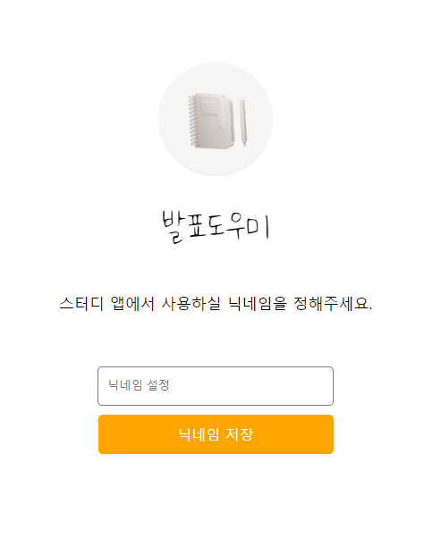
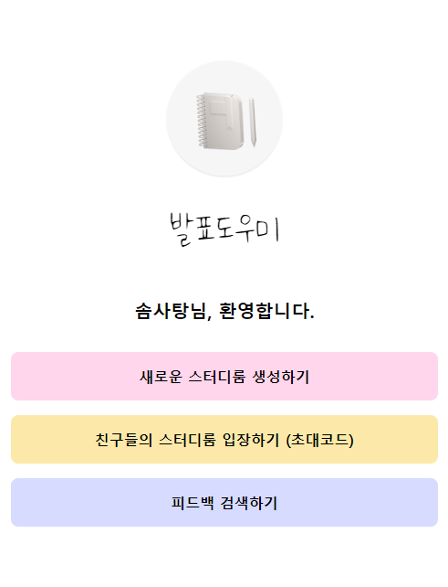
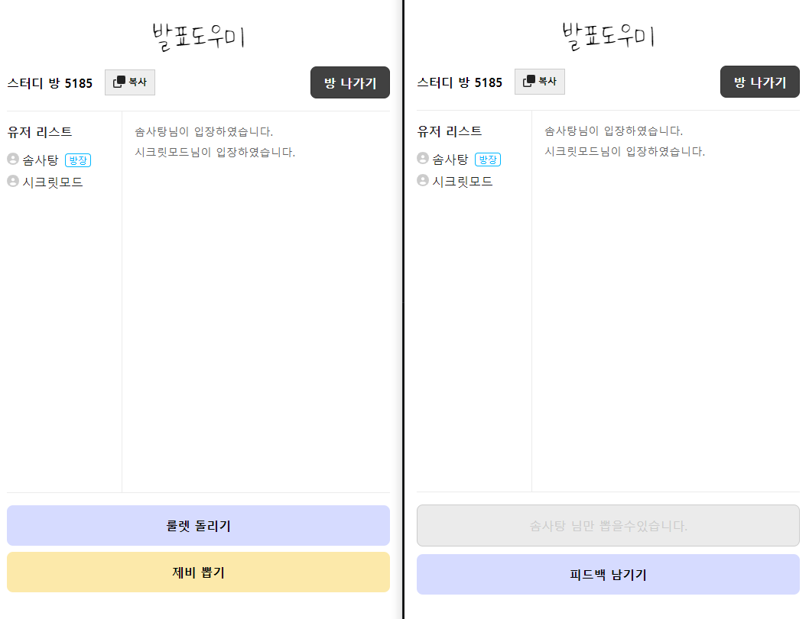
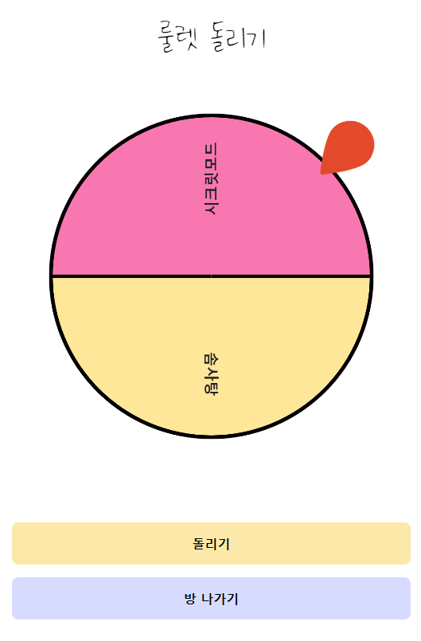
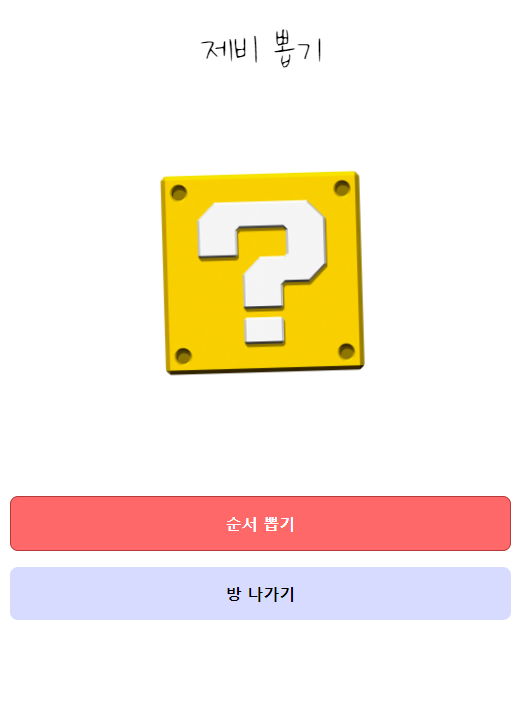

# Study P.A - 스터디 발표


<br>

```What It is?``` : 스터디를 진행하는 개발자들 위한 발표 도우미 !

<br>

## 제작자

🏷 프론트엔드
- 💁‍♂️ 솜사탕 ➡️ <a href="https://github.com/sstipdev">Github</a>
- 💁🏻‍♀️ 비니루 ➡️ <a href="https://github.com/hmyo2853">Github</a>

🖥 백엔드

- 💁‍♂️ 준서 ➡️ <a href="https://github.com/kimjunseoo">Github</a>
- 💁🏻‍♀️ 혜린 ➡️ <a href="https://github.com/OolongTea620">Github</a>

<br>

## 최종 구현 화면

- vercel - [https://cottoncandy-study.netlify.app](https://cottoncandy-study.netlify.app)


### 닉네임(로그인) 설정




### 홈(로비)




### 방 생성 및 방 참여




## 룰렛 / 제비 (추첨)

<p align="left">


</p>

<br>

## 프로젝트 진행 목적

- `React` `Typescript` 컴포넌트 모듈화
- `async`, `await`로 비동기 프로그래밍 코드 작성
- `Emotion` 사용으로 재사용 컴포넌트 구성
- `Fetch`로 상태 관리 및 API 통신
- `vite create` 및 `netlify` 배포
- `LocalStorage`로 닉네임(로그인) 기능 구현
- `Socket-Io`로 실시간 통신 구현
- 프론트와, 백엔드의 `협업` 경험

<br>

## 구현 요구 사항 목록

- [✅] 컴포넌트 모듈화
- [✅] 닉네임(로그인) 기능 구현
- [✅] 라우터로별 뷰 단 구현 (닉네임(로그인), 방 생성, 방 참여, 룰렛, 제비, 피드백)
- [✅] 심플하고 가독성이 높은 UI
- [✅] Emotion 으로 재사용 컴포넌트 구성
- [✅] Socket-Io로 실시간 통신 기능 구현(방 생성 및 참여)
- [✅] 참여한 사용자에게 피드백 전송
- [✅] Roulette, 제비 뽑기 기능 구현
- [✅] Recoil 전역 상태관리

<br>

## 사용한 프레임워크 및 라이브러리 설명

- React: 컴포넌트 기반의 화면구성, Virtual DOM으로 인한 속도 향상, SPA(싱글 페이지 애플리케이션)
- TypeScript: 초기 데이터와 컴포넌트 사이에 전달되는 데이터의 컴파일 오류를 방지하기 위해 사용
- Fetch: 데이터 패칭시 로딩, 에러 state 관리 및 API 통신 위해 사용
- Emotion: 재사용 컴포넌트 구성
- Vite: build 속도를 빠르게 하기 위해 사용
- LocalStorage: 사용자 데이터 저장 및 로그인 기능 구현을 위해 사용
- Recoil : 보다 쉬운 전역 상태관리 및 Props Drilling을 해결하기 위해 사용
- Socket-Io : 실시간 통신을 위해 사용

## 실행 방법

```
yarn -i

yarn run dev
```